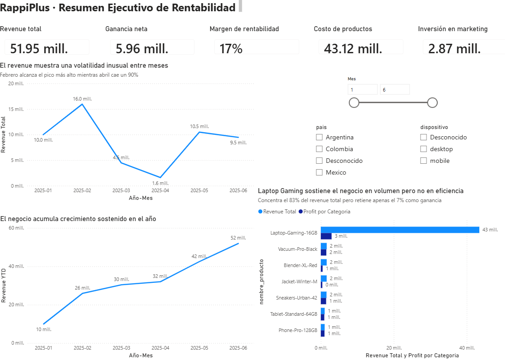

# 🚀 Proyecto Integrador | Análisis Integral de Negocio, Funnels y Pruebas A/B (RappiPlus – s12)

> El objetivo de este proyecto es exhibir la **metodología analítica, la arquitectura de la solución end-to-end y el dominio técnico** en SQL, Python (Pandas, SciPy, Statsmodels) y BI para resolver problemas complejos de rentabilidad, comportamiento del usuario y experimentación estadística.

---

## 🎯 Objetivo del Proyecto
Desarrollar un análisis integral de negocio sobre la plataforma de suscripción **RappiPlus**, evaluando la calidad de datos (ETL), la rentabilidad del servicio, los puntos de fuga en el embudo de conversión (*Funnels*), la tasa de retención por cohortes y la validación estadística de nuevas funcionalidades mediante Pruebas A/B.

---

## 🛠️ Tecnologías Utilizadas
* **Python (Pandas, SciPy, Statsmodels):** Limpieza/ETL de datasets heterogéneos, modelado cuantitativo y prueba Z de proporciones para análisis A/B ($\alpha = 0.05$).
* **SQL (PostgreSQL):** Consultas avanzadas para el mapeo del funnel de eventos, análisis de *drop-off* y construcción de modelos de retención por cohortes.
* **Power BI / Tableau:** Visualización ejecutiva bajo el marco **C-F-I** (Contexto, Findings, Impacto) para la toma de decisiones estratégicas.
* **Analytics End-to-End & Unit Economics:** Evaluación del ciclo de vida del usuario, CAC, ROAS y margen neto.

---

## 📐 Arquitectura de la Solución

```mermaid
flowchart TD
    classDef rawData fill:#F87171,stroke:#991B1B,stroke-width:2px,color:#FFFFFF
    classDef etl fill:#FBBF24,stroke:#92400E,stroke-width:2px,color:#000000
    classDef sql fill:#60A5FA,stroke:#1E40AF,stroke-width:2px,color:#FFFFFF
    classDef stat fill:#A78BFA,stroke:#4C1D95,stroke-width:2px,color:#FFFFFF
    classDef bi fill:#34D399,stroke:#065F46,stroke-width:2px,color:#FFFFFF

    subgraph S1["1. Fuentes de Datos Heterogéneas"]
        A1[rappiplus_orders_raw]:::rawData
        A2[rappiplus_catalog]:::rawData
        A3[rappiplus_marketing_spend]:::rawData
        A4[events]:::rawData
    end

    subgraph S2["2. Preparación & Calidad de Datos (Python / ETL)"]
        B1["Imputación de Nulos & Limpieza"]:::etl
        B2["Eliminación de Duplicados"]:::etl
        B3["Estandarización de Tipos de Datos"]:::etl
        B4[Dataset Master Limpio]:::etl
    end

    subgraph S3["3. Modelado Analítico & Métricas (SQL & Python)"]
        C1["<b>Rentabilidad & Unit Economics</b><br/>(Ingresos - Costos - CAC = Margen)"]:::sql
        C2["<b>Funnel de Conversión</b><br/>(Drop-off por etapa en 'events')"]:::sql
        C3["<b>Análisis de Retención</b><br/>(Cohortes por fecha de registro)"]:::sql
    end

    subgraph S4["4. Experimentación A/B (Python / SciPy)"]
        D1["Evaluación de Interfaz de Checkout"]:::stat
        D2["Planteamiento de Hipótesis (H0 vs H1)"]:::stat
        D3["Z-Test de Proporciones (alpha = 0.05)"]:::stat
        D4["Validación Estadística (p-value < 0.05)"]:::stat
    end

    subgraph S5["5. Visualización & Estrategia (Power BI / Tableau)"]
        E1["Dashboard Ejecutivo (C-F-I)"]:::bi
        E2["Reasignación de Presupuesto ROAS"]:::bi
        E3["Optimización de Puntos de Fuga UX"]:::bi
    end

    %% Conexiones
    A1 --> B1
    A2 --> B1
    A3 --> B1
    A4 --> B1
    
    B1 --> B2 --> B3 --> B4

    B4 --> C1
    B4 --> C2
    B4 --> C3

    C2 --> D1
    D1 --> D2 --> D3 --> D4

    C1 --> E1
    C3 --> E1
    D4 --> E1

    E1 --> E2
    E1 --> E3

---

## 📊 Vista Previa del Dashboard Ejecutivo

A continuación se muestra el panel interactivo desarrollado para la alta dirección, donde se integran los hallazgos de rentabilidad, fuga de conversión en funnels y los resultados del experimento A/B:



*Figura 1: Dashboard ejecutivo con métricas de Unit Economics, embudo de conversión y resultados de la prueba A/B.*

---

## 📂 Contenido del Repositorio
* `/data/`: Datasets limpios e integrados (`rappiplus_orders_raw`, `catalog`, `marketing_spend`).
* `/scripts/`: Consultas SQL para el análisis de Funnel y Retención por Cohortes.
* `/notebooks/`: Jupyter Notebooks con la canalización ETL y la evaluación estadística de la prueba A/B.
* `/dashboards/`: Archivos interactivos de Power BI / Tableau para la presentación de resultados.
* `/docs/`: Diagramas de arquitectura analítica, resumen ejecutivo y capturas del dashboard.
