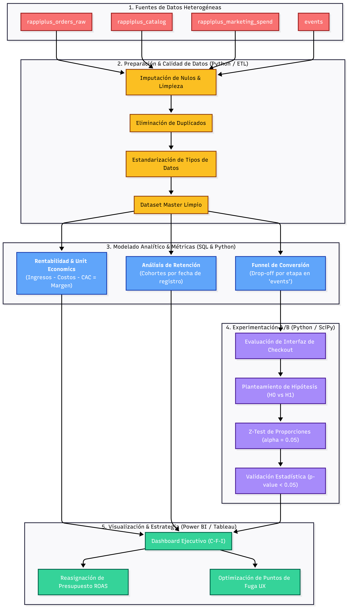
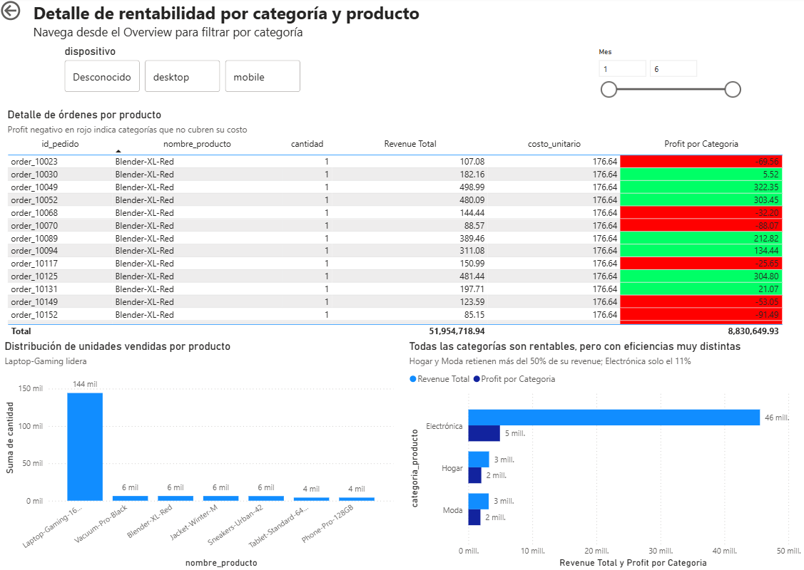

# 🚀 Proyecto Integrador | Análisis Integral de Negocio, Funnels y Pruebas A/B (RappiPlus – s12)

> El objetivo de este proyecto es exhibir la **metodología analítica, la arquitectura de la solución end-to-end y el dominio técnico** en SQL, Python (Pandas, SciPy, Statsmodels) y BI para resolver problemas complejos de rentabilidad, comportamiento del usuario y experimentación estadística.

---

## 🎯 Objetivo del Proyecto
Desarrollar un análisis integral de negocio sobre la plataforma de suscripción **RappiPlus**, evaluando la calidad de datos (ETL), la rentabilidad del servicio, los puntos de fuga en el embudo de conversión (*Funnels*), la tasa de retención por cohortes y la validación estadística de nuevas funcionalidades mediante Pruebas A/B.

---

## 🛠️ Tecnologías Utilizadas
* **Python (Pandas, SciPy, Statsmodels):** Limpieza/ETL de datasets heterogéneos, modelado cuantitativo y prueba Z de proporciones para análisis A/B ($\alpha = 0.05$).
* **SQL:** Consultas avanzadas para el mapeo del funnel de eventos, análisis de *drop-off* y construcción de modelos de retención por cohortes.
* **Power BI / Tableau:** Visualización ejecutiva bajo el marco **C-F-I** (Contexto, Findings, Impacto) para la toma de decisiones estratégicas.
* **Analytics End-to-End & Unit Economics:** Evaluación del ciclo de vida del usuario, CAC, ROAS y margen neto.

---

## 📐 Arquitectura de la Solución

---

## 📊 Vista Previa del Dashboard Ejecutivo

A continuación se muestra el panel interactivo desarrollado para la alta dirección, donde se integran los hallazgos de rentabilidad, fuga de conversión en funnels y los resultados del experimento A/B:

*Figura 1: Dashboard ejecutivo con métricas de Unit Economics, embudo de conversión y resultados de la prueba A/B.*

---

## 📂 Contenido del Repositorio
* `/data/`: Datasets limpios e integrados (`rappiplus_orders_raw`, `catalog`, `marketing_spend`).
* `/scripts/`: Consultas SQL para el análisis de Funnel y Retención por Cohortes.
* `/notebooks/`: Jupyter Notebooks con la canalización ETL y la evaluación estadística de la prueba A/B.
* `/dashboards/`: Archivos interactivos de Power BI / Tableau para la presentación de resultados.
* `/docs/`: Diagramas de arquitectura analítica, resumen ejecutivo y capturas del dashboard.
